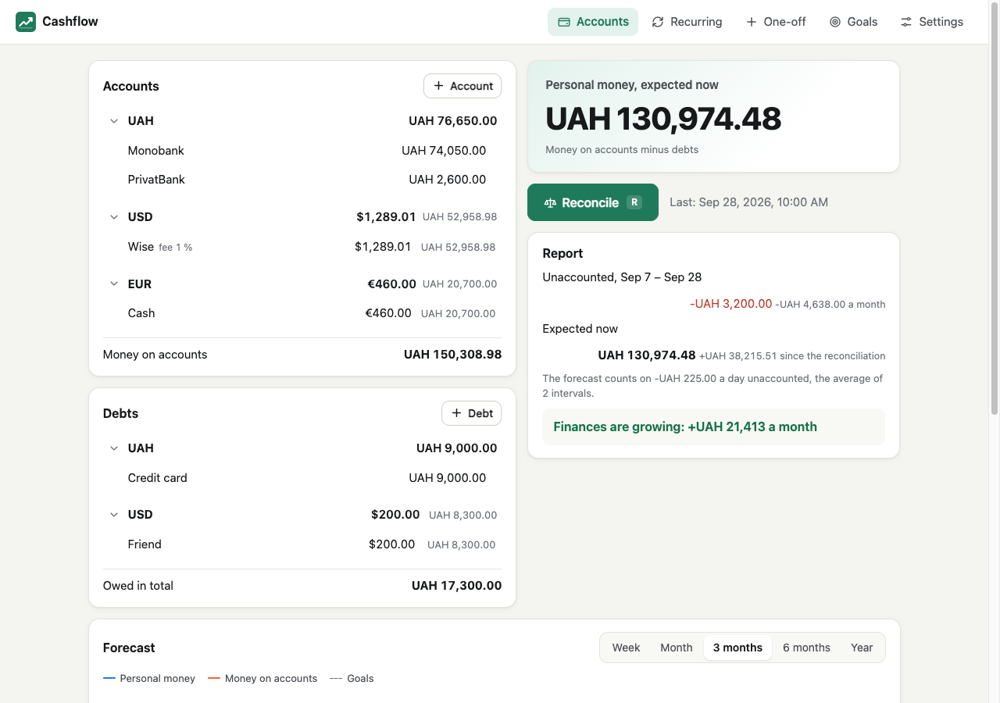

# Cashflow

<!-- languages -->
<h3 align="center">
<a href="../../README.md">🇬🇧 English</a> ·
<a href="README.zh.md">🇨🇳 中文</a> ·
<a href="README.hi.md">🇮🇳 हिन्दी</a> ·
<a href="README.es.md">🇪🇸 Español</a> ·
<b>🇫🇷 Français</b> ·
<a href="README.ar.md">🇸🇦 العربية</a> ·
<a href="README.bn.md">🇧🇩 বাংলা</a> ·
<a href="README.pt.md">🇧🇷 Português</a> ·
<a href="README.ru.md">🇷🇺 Русский</a> ·
<a href="README.ur.md">🇵🇰 اردو</a> ·
<a href="README.id.md">🇮🇩 Bahasa Indonesia</a> ·
<a href="README.de.md">🇩🇪 Deutsch</a> ·
<a href="README.ja.md">🇯🇵 日本語</a> ·
<a href="README.mr.md">🇮🇳 मराठी</a> ·
<a href="README.te.md">🇮🇳 తెలుగు</a> ·
<a href="README.tr.md">🇹🇷 Türkçe</a> ·
<a href="README.uk.md">🇺🇦 Українська</a>
</h3>
<!-- /languages -->

**Cashflow** suit vos finances personnelles sans enregistrer chaque dépense. Vous configurez
une fois vos comptes, vos dettes et vos revenus et paiements réguliers. De temps en temps, vous
**rapprochez** : vous saisissez les soldes réels. L'appli calcule combien d'argent n'a pas été
comptabilisé, prévoit les mois à venir, dit combien de temps l'argent va durer et quand vous
pourrez acheter ce que vous voulez.

Toute l'appli tient dans un seul fichier HTML autonome qui fonctionne hors ligne : pas de
compte, pas de cloud, aucune requête réseau. Les données forment une base SQLite (SQLite
compilé en WebAssembly, à l'intérieur du fichier) que le navigateur conserve sur cet appareil.
La même page est aussi une PWA installable, qui s'exécute dans sa propre fenêtre.



## Utilisation

1. Téléchargez `cashflow-<version>.html` depuis les releases (ou construisez-le :
   `./build.sh`) et ouvrez-le dans un navigateur — depuis le disque, ça fonctionne aussi.
2. Choisissez la devise de base : chaque total y est affiché. Dans **Paramètres**, ajoutez les
   autres devises que vous détenez, avec leurs taux — saisis à la main, l'appli ne se connecte
   jamais à internet.
3. Dans **Comptes**, ajoutez vos comptes (une carte, des espèces, un dépôt, une plateforme
   d'échange) et vos dettes (une carte de crédit, un prêt, de l'argent emprunté), chacun avec
   son solde actuel.
4. Cliquez sur **Rapprocher** (ou <kbd>R</kbd>). Chaque champ contient déjà le solde attendu ;
   corrigez ce qui diffère et enregistrez. La prévision commence ici.
5. Dans **Récurrent**, ajoutez le salaire, le loyer, les abonnements, le paiement mensuel de la
   carte — quotidien, hebdomadaire, mensuel ou annuel. Dans **Ponctuel**, ajoutez ce que les
   opérations régulières ne couvrent pas : un achat, une prime, des vacances prévues.
6. Toutes les une ou deux semaines, rapprochez à nouveau. Le rapport indique ce qui n'a pas été
   comptabilisé et combien de temps l'argent va durer, et les objectifs dans **Objectifs**
   disent quand ils pourront être achetés.

### Sur un téléphone

Les onglets se déplacent dans une barre en bas, et les formulaires s'ouvrent en feuilles au bas
de l'écran ; le clavier ne couvre pas le champ en cours de saisie. Installez la version en
ligne : sous Android, menu ⋮ de Chrome → Installer l'application ; sous iOS, Partager → Sur
l'écran d'accueil. Il n'y a pas de synchronisation entre appareils : pour déplacer les données,
exportez-les sur l'un et importez-les sur l'autre (Paramètres → Données).

## Fonctionnement

### Rapprochement

Un rapprochement est un instantané des soldes réels de tous les comptes et dettes à un moment
donné. Le formulaire affiche, pour chaque compte, ce que les enregistrements attendent : le
solde trouvé la dernière fois plus chaque opération depuis qui concerne ce compte. Vous ne
modifiez que ce qui diffère. L'instantané conserve les soldes, les noms, les frais et les taux
de ce moment-là, et n'est jamais recalculé : renommer un compte, l'archiver, modifier une
opération ou changer la devise de base laisse les rapprochements passés exactement comme ils
étaient. Seul le dernier peut être supprimé — pour annuler un rapprochement fait par erreur.

### D'où vient l'argent non comptabilisé

Pour chaque devise, l'appli additionne ce qu'elle attendait — les soldes trouvés la dernière
fois, les soldes d'ouverture des comptes créés depuis, et chaque opération récurrente et
ponctuelle sur la période — et le compare à ce que vous avez saisi. La différence est l'argent
non comptabilisé : moins signifie des dépenses non enregistrées, plus des revenus non
enregistrés. Il est compté par devise, et non sur le total en devise de base, pour qu'une
variation du taux de change entre deux rapprochements ne soit pas prise pour une dépense. Un
nouveau compte apporte son solde d'ouverture avec lui, donc le créer n'est pas un revenu non
comptabilisé ; archiver un compte avec de l'argent restant demande où cet argent est allé (un
autre compte, ou dépensé), pour que rien ne reste non comptabilisé non plus.

### La prévision et « L'argent dure jusqu'au »

La prévision part du dernier rapprochement et ajoute chaque opération depuis — c'est
« attendu maintenant ». De là, elle avance jour par jour jusqu'à l'horizon (cinq ans par
défaut) : les opérations récurrentes, les opérations ponctuelles prévues et, sauf désactivation,
le rythme moyen des dépenses non comptabilisées (l'argent non comptabilisé des rapprochements
des 90 derniers jours, réparti sur leurs jours). Les revenus non comptabilisés ne sont pas pris
en compte. « L'argent dure jusqu'au » est le premier moment où l'argent sur les comptes atteint
zéro ; si l'argent personnel (les comptes moins les dettes) passe sous zéro plus tôt, cette date
vient en second. Si ni l'un ni l'autre ne se produit dans l'horizon, le rapport dit que l'argent
dure plus longtemps — ou, s'il augmente, de combien par mois. La date d'un objectif est le
premier moment où la prévision atteint son seuil.

### Les frais, et pourquoi le frais d'une dette l'agrandit

Le frais d'un compte est la part perdue quand son argent est converti en devise de base :
1 000 USD sur un compte avec un frais de 1 % valent 1 000 × 41.5 × 0.99 = 41 085 UAH. Le frais
d'une dette fonctionne à l'inverse — **c'est une décision par défaut** : rembourser une dette
dans une autre devise, ou par l'intermédiaire de quelqu'un, coûte plus que sa valeur nominale,
donc une dette de 200 USD avec un frais de 2 % compte comme 200 × 41.5 × 1.02 = 8 466 UAH dues.
L'argent hors des comptes et les prix des objectifs se convertissent au taux brut.

### Pourquoi supprimer une opération ne change pas le passé

Une opération récurrente a des versions. La modifier clôt la version en vigueur à cet instant
et en ouvre une nouvelle à partir de maintenant ; la supprimer ne fait que la clore. Le temps
écoulé depuis le dernier rapprochement est toujours compté avec la version alors en vigueur,
si bien que le prochain rapprochement n'est pas surpris, et les rapprochements déjà effectués
ne changent jamais. Une opération ponctuelle datée d'avant le dernier rapprochement se trouve
dans une période close : elle peut être gardée comme note, mais ne change rien.

Les intérêts des prêts ne sont pas modélisés : ajoutez-les comme une dépense récurrente, et le
remboursement lui-même comme un virement vers la dette.

## Fonctionnalités

- Comptes et dettes groupés par devise, repliables, avec le total dans la devise et en devise
  de base ; l'argent personnel en gros caractères.
- N'importe quel code de devise de 2 à 10 lettres et chiffres (USD, EUR, USDT, BTC), avec son
  propre nombre de décimales ; les montants sont des entiers en unités mineures, donc aucune
  dérive d'arrondi.
- Montants saisis avec une virgule ou un point, des espaces ou des apostrophes entre les
  milliers, et de l'arithmétique simple : `1200+350-50*2`.
- Opérations récurrentes quotidiennes (avec une heure), hebdomadaires, mensuelles (un jour, ou
  le dernier jour) ou annuelles, en vigueur à partir d'un moment et jusqu'à une date ; le 31
  dans un mois plus court est son dernier jour, et le 29 février d'une année non bissextile est
  le 28. Les heures sont locales, de sorte qu'une opération quotidienne à 09:00 reste à 09:00
  même au passage à l'heure d'été ou d'hiver.
- Opérations ponctuelles avec un formulaire rapide : le curseur dans le champ du montant,
  Entrée enregistre, le dernier compte utilisé.
- Virements entre comptes en devises différentes, avec le montant crédité ; un virement vers
  une dette la rembourse.
- Le graphique de prévision sur une semaine, un mois, 3 ou 6 mois ou un an : argent personnel,
  argent sur les comptes, la ligne zéro et les objectifs ; un réticule avec les valeurs, et les
  mêmes chiffres sous forme de tableau.
- Objectifs achetés « avec de l'argent de reste » (argent personnel au moins égal au prix plus
  une marge) ou « en proportion » (le prix au plus une part de l'argent personnel) ; Acheté
  enregistre la dépense.
- Un rapprochement passé ouvre l'onglet Comptes tel qu'il était, avec ce qui était attendu et ce
  qui a été trouvé, et ce qui a été enregistré sur la période.
- Export et import en JSON ou sous forme du fichier SQLite lui-même ; dans Chrome et Edge, une
  copie automatique écrite dans un fichier de votre choix après chaque modification.
- « Nouvelle base de données… » dans Paramètres : tout est remplacé par une base de données
  vide, après un avertissement qui propose un export et, si un code PIN existe, le demande.
- Un code PIN à quatre chiffres pour la base de données, demandé à sa création : la page
  n'affiche rien tant qu'il n'est pas saisi, et chaque code erroné double la pause avant le
  prochain essai, d'une seconde jusqu'à une heure.
- Thèmes clair et sombre, 17 langues, de droite à gauche pour l'arabe et l'ourdou, une mise en
  page pour téléphone.

## Raccourcis clavier

| Touche | Action |
| --- | --- |
| <kbd>R</kbd> | Rapprocher |
| <kbd>N</kbd> | Un nouveau compte, une nouvelle opération récurrente ou un nouvel objectif sur l'onglet ouvert ; le montant du formulaire rapide dans Ponctuel |
| <kbd>Entrée</kbd> | Dans un formulaire : le champ suivant ; dans le dernier, enregistre |
| <kbd>Échap</kbd> | Ferme la boîte de dialogue |

Sur un écran tactile, les indications de touches ne sont pas affichées.

## Sécurité et confidentialité

- Rien ne quitte la page. La Content Security Policy dans `src/app/template.html` comporte
  `default-src 'none'` et `connect-src 'none'` ; WebAssembly est autorisé pour SQLite
  (`'wasm-unsafe-eval'`), `blob:` pour le téléchargement de l'export. Le build s'arrête sur tout
  `src` ou `href` externe, et la CI vérifie à nouveau.
- Les données vivent dans l'IndexedDB de ce navigateur : un enregistrement contenant les octets
  de la base SQLite, réécrit en entier après chaque modification, de sorte qu'une sauvegarde
  n'est jamais à moitié faite. `localStorage` ne contient que la langue, le thème, l'onglet
  ouvert, les groupes repliés, la période du graphique et la pause après un code PIN erroné.
- Lire la base ou un fichier importé vérifie chaque champ : une valeur corrompue est remplacée
  par sa valeur par défaut plutôt que d'arrêter l'appli.
- Après la première sauvegarde, l'appli demande au navigateur de conserver son espace de
  stockage (`navigator.storage.persist()`), pour qu'un disque qui se remplit ne fasse pas perdre
  les données.
- Le code PIN arrête quelqu'un devant un ordinateur déverrouillé, pas quelqu'un qui copie les
  fichiers du navigateur : les données ne sont pas chiffrées. Seul son hash est stocké (PBKDF2
  avec un sel), parmi les paramètres de la base de données, de sorte qu'un export l'emporte avec
  lui et demande le même code PIN partout où il est importé. Un code PIN oublié ne peut pas être
  récupéré : « Code PIN oublié ? » supprime la base de données et en démarre une nouvelle, vide.

## Traductions

Le texte anglais reste dans le code : `t('accounts', 'Reconcile')`, `tn('time', '{count} day
ago', '{count} days ago', n)`, et `data-i18n="context"` / `data-i18n-attr="context"` dans le
gabarit. Le premier argument est le contexte — la partie de l'interface à laquelle appartient
une chaîne, de sorte que le même mot anglais puisse être traduit différemment à deux endroits.
Un dictionnaire, `src/locales/<code>.json`, associe contexte → texte anglais → traduction :

```json
{
  "accounts": { "Reconcile": "Сверить" },
  "time": { "{count} days ago": { "one": "{count} день назад", "few": "{count} дня назад", "many": "{count} дней назад", "other": "{count} дня назад" } }
}
```

Une chaîne absente du dictionnaire s'affiche en anglais. Un texte avec un nombre a une forme par
catégorie de pluriel de la langue (`Intl.PluralRules`), classée sous la forme plurielle
anglaise. `npm run i18n` liste, par langue, les chaînes pas encore traduites et celles qui ne
sont plus utilisées ; `npm test` vérifie que chaque traduction conserve les marqueurs de
substitution anglais et possède toutes les formes de pluriel. Le nom « Cashflow » n'est jamais
traduit.

Ce README est traduit aussi : `docs/readme/README.<code>.md`, un par langue, avec la liste des
langues en haut de chacun. Un changement ici doit aussi se retrouver dans les traductions.

## Compilation

```sh
./build.sh            # installe les dépendances si besoin, puis construit build/cashflow.html
npm install
npm run build         # -> build/cashflow.html et build/pages/
npm run watch         # reconstruit à chaque changement dans src/
npm run typecheck     # tsc --noEmit
npm test              # money, valuation, schedules, reconciliation, forecast, goals, state, SQLite, dictionnaires
npm run test:browser  # la page construite et la PWA dans un Chrome headless
npm run i18n          # chaînes manquantes ou devenues inutiles dans chaque dictionnaire
npm run check         # typecheck, test, build et test:browser à la suite
npm run shots -- shots/after  # construit, puis capture chaque onglet dans shots/after
node tools/icons.mjs  # les icônes PNG de la PWA à partir de assets/icon.svg
```

`build.mjs` regroupe `src/app/main.ts` avec esbuild en une IIFE — le WebAssembly de SQLite y
entre sous forme d'octets via le chargeur binaire d'esbuild — et l'insère, avec les styles et
l'icône (un data URI), dans `src/app/template.html`. Le résultat est `build/cashflow.html`,
environ 1.4 Mo : surtout SQLite, puis les 16 dictionnaires.

La même exécution écrit `build/pages/` : cette page comme PWA installable — `index.html` avec
un lien vers le manifeste et un `<meta name="service-worker">` qui dit à la page d'enregistrer
son worker, `manifest.webmanifest`, les icônes et `sw.js`, qui met la page en cache pour
qu'elle s'ouvre hors ligne.

`tests/app.mjs` pilote la page construite dans un Chrome headless via le protocole DevTools
(`tools/chrome.mjs`, sans dépendances) : le premier démarrage, les comptes des exemples de
l'énoncé et leurs totaux, deux rapprochements à une semaine d'écart avec −1 500 non
comptabilisé, la suppression d'une opération sans changer l'historique, un rapprochement passé,
des objectifs, export → effacement → import, la PWA hors ligne et sa mise à jour, un téléphone,
et la page ouverte depuis le disque qui conserve ses données. Le temps n'est jamais attendu :
un script inséré avant celui de la page remplace `Date.now()`, et le fuseau horaire est
Europe/Kyiv, de sorte qu'une semaine avec changement d'heure est testée aussi.

## Versions et releases

La version est écrite à un seul endroit, `package.json`. Le build l'inscrit dans la page (en
bas des paramètres) et dans le nom de cache de la PWA. Un build du commit marqué `v<version>`
l'affiche telle quelle ; tout autre ajoute son commit, `0.1.0+1a2b3c4`, pour qu'une page
provenant de `main` ne soit pas prise pour la release.

```sh
npm version minor           # 0.1.0 -> 0.2.0 : package.json, package-lock.json, un commit et le tag v0.2.0
git push --follow-tags      # le tag déclenche .github/workflows/release.yml
```

Le workflow de release s'arrête si le tag et `package.json` ne concordent pas, puis joint
`cashflow-<tag>.html` et `SHA256SUMS.txt`.

## GitHub Pages

`.github/workflows/pages.yml` construit et teste chaque push vers `main` et déploie
`build/pages/` sur GitHub Pages (Settings → Pages → Source : GitHub Actions). Les données de la
version en ligne appartiennent à son adresse ; une copie ouverte depuis le disque a ses propres
données.

Chaque déploiement change le nom de cache dans `sw.js`, de sorte que le navigateur récupère
lui-même le nouveau worker — au démarrage avec une connexion, toutes les quelques heures
pendant que l'appli est ouverte, ou quand Paramètres → Rechercher des mises à jour le demande.
Le nouveau worker télécharge sa version dans un cache qui lui est propre et attend ; celui en
cours continue de servir l'ancienne page, hors ligne aussi. Les paramètres, avec un point sur
leur onglet, disent alors « La version … est prête » : Mettre à jour enregistre ce qui attend,
laisse entrer le nouveau worker et recharge la page, qui indique une fois qu'elle a été mise à
jour. Sans le bouton, la nouvelle version démarre une fois toutes les fenêtres de l'appli
fermées. Un fichier téléchargé reste la version qu'il est ; pour une version fixée sur le
disque, prenez `cashflow-<tag>.html` depuis une release et comparez-le avec `SHA256SUMS.txt`.

## Organisation

```
src/core/             aucun DOM : les tests l'exécutent dans Node
  money.ts            unités mineures ; lecture des montants saisis et arithmétique ; mise en forme dans une langue
  valuation.ts        comptes et dettes en devise de base, avec les frais
  schedule.ts         quand une opération récurrente a lieu, en heure locale
  flows.ts            les opérations comme mouvements d'argent entre comptes et devises
  reconcile.ts        soldes attendus et réels, l'instantané, l'argent non comptabilisé et son rythme
  forecast.ts         la courbe à venir, quand l'argent s'épuise, quand un seuil est atteint
  goals.ts            le seuil, la progression et la date d'un objectif
  pin.ts              le code PIN de la base de données : son hash salé, sa vérification, la pause après les essais erronés
  state.ts            les types de l'état, la vérification de ce qui est lu, les migrations d'anciens documents
  db.ts               l'état dans SQLite : le schéma et ses migrations, une transaction par sauvegarde
  sqlite.ts           sql.js avec son WebAssembly intégré
  i18n.ts             t()/tn(), la liste des langues, la traduction du balisage de la page
src/app/              la page : le fichier unique et la PWA
  template.html       balisage avec les emplacements __STYLES__/__APP__/__ICON__, la CSP
  styles.css          palette, thèmes clair et sombre, la mise en page téléphone
  main.ts             démarrage, onglets, dessin, raccourcis
  store.ts            l'état en mémoire, sauvegardé dans SQLite et IndexedDB peu après chaque changement
  storage.ts          IndexedDB : les octets de la base, le descripteur de fichier de la copie automatique ; persist()
  lock.ts             l'écran demandant le code PIN, la question d'une nouvelle base de données, sa carte dans Paramètres
  prefs.ts            localStorage : langue, thème, onglet, groupes repliés, période du graphique
  accounts.ts         l'onglet Comptes, le rapport, l'historique, un rapprochement passé
  account-dialog.ts   créer, modifier, archiver et supprimer des comptes et des dettes
  reconcile-form.ts   le formulaire de rapprochement
  recurring.ts        l'onglet Récurrent et son formulaire ; versions des opérations
  oneoff.ts           l'onglet Ponctuel et son formulaire rapide
  op-fields.ts        les champs communs aux opérations : type, montant, compte ou devise, virement
  goals.ts            l'onglet Objectifs, Acheté
  chart.ts            le graphique de prévision, en SVG écrit à la main
  settings.ts         l'onglet Paramètres : devises et taux, prévision, langue, thème, données, code PIN
  backup.ts           export et import (JSON et SQLite), la copie automatique
  update.ts           les mises à jour de la PWA
  ui.ts, dom.ts       boîtes de dialogue, toasts, champs ; construction du DOM
  format.ts, inputs.ts  montants et dates dans la langue de l'interface ; le champ de montant
src/pwa/sw.js         le service worker du build Pages
src/locales/          un dictionnaire par langue
assets/               l'icône ; pwa/, ses tailles PNG pour la PWA
tests/                tests unitaires du cœur avec les chiffres fixes de l'énoncé ; app.mjs, la page dans Chrome
tools/                load.mjs, chrome.mjs, i18n.mjs, shots.mjs, sample.mjs, icons.mjs
docs/                 la capture d'écran ci-dessus ; readme/, ce README dans les autres langues
build/                le résultat du build ; build/pages/ est la PWA pour GitHub Pages
```

## Limites

- Pas de synchronisation entre appareils : les données restent dans le navigateur où elles ont
  été saisies. Les déplacer, c'est exporter sur l'un et importer sur l'autre.
- Les taux de change sont saisis à la main : l'appli ne se connecte jamais à internet pour eux.
- Une page ouverte depuis le disque conserve ses données dans le stockage de ce navigateur pour
  les fichiers locaux. Chrome et Edge la conservent (les tests du navigateur le vérifient) ;
  Firefox et Safari le font aussi normalement, mais certaines configurations et les fenêtres de
  navigation privée non — la page le signale alors en haut et fonctionne uniquement en mémoire :
  exportez les données, ou utilisez l'appli installée.
- Les intérêts des prêts ne sont pas modélisés ; c'est une dépense récurrente que vous ajoutez.
- Chaque objectif est mesuré indépendamment : acheter l'un ne se déduit pas des autres.

## Licence

MIT — voir [LICENSE](../../LICENSE). sql.js (SQLite compilé en WebAssembly) est sous licence
MIT ; SQLite lui-même est dans le domaine public.
